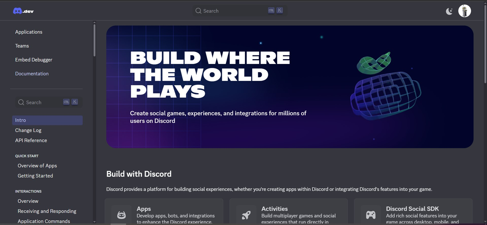

# LambdaCrypter — Ferramenta Educacional de Ransomware


*Imagem placeholder - banner em desenvolvimento*

## Status do Projeto


[](LICENSE)


## **Aviso Importante**
**LambdaCrypter é estritamente uma ferramenta educacional.**  
Seu propósito é ensinar e demonstrar o comportamento de ransomwares em **ambientes controlados**, com foco em estudo de segurança cibernética, defesa, análise de malware e resposta a incidentes.  

**NUNCA utilize em:**
- Sistemas de terceiros sem autorização
- Ambientes de produção
- Dados reais ou importantes

Qualquer uso indevido pode ser ilegal e antiético.

---

## Sobre o Projeto

O **LambdaCrypter** é uma ferramenta educacional avançada projetada para simular o comportamento de ransomwares em ambientes controlados. Seu objetivo principal é capacitar profissionais e estudantes de segurança cibernética a compreenderem profundamente as técnicas, táticas e procedimentos (TTPs) utilizados por agentes maliciosos, sem os riscos associados à manipulação de ameaças reais.

Utilizando um bot do Discord como canal de Comando e Controle (C2), o LambdaCrypter replica a arquitetura de ataques cibernéticos modernos, oferecendo um ambiente seguro para estudos em criptografia aplicada, detecção de ameaças e resposta a incidentes.

**Objetivo de desenvolvimento:** Aprimorar a ferramenta em cada devlog, tornando-a cada vez mais robusta.

---

## História desse tipo de **Malware**

Ransomwares evoluíram de experimentos simples para operações criminosas comerciais altamente organizadas. O primeiro caso conhecido, muitas vezes citado como **PC Cyborg** (1989), já trazia a ideia central — bloquear o acesso a dados e exigir pagamento —, mas com técnicas rudimentares. Na década seguinte surgiram variantes mais sofisticadas; em 2013, famílias como **CryptoLocker** popularizaram criptografia forte e pagamentos via criptomoedas. Eventos como **WannaCry** e **NotPetya** (2017) demonstraram o impacto em larga escala e a capacidade de exploração de vulnerabilidades, elevando a importância de defesas automatizadas, análise e preparação. Hoje vemos modelos de negócio criminoso como **Ransomware-as-a-Service (RaaS)**, campanhas direcionadas a empresas e cadeias de suprimento, e mecanismos avançados de evasão e persistência.

Por isso, ferramentas educacionais controladas — que simulam TTPs (Técnicas, Táticas e Procedimentos) sem causar dano real — são essenciais para treinar detecção, resposta e mitigação, além de permitir experimentação segura com criptografia, comunicação C2 e técnicas de hardening.

### Linha do tempo (resumo)
- **1989** – *PC Cyborg*: conceito inicial de sequestrar acesso a arquivos.
- **Anos 2000–2010** – evolução em técnicas de distribuição e criptografia.
- **2013** – *CryptoLocker*: adoção massiva de criptografia forte e pagamentos por Bitcoin.
- **2017** – *WannaCry / NotPetya*: ataques em larga escala explorando vulnerabilidades conhecidas.
- **2020+** – profissionalização do ecossistema (RaaS), ataques dirigidos e foco em exfiltração/duplo extortion.

---

### Para Diferentes Públicos

| Público | O que ganha | Exemplos de uso prático |
|---------|------------|-------------------------|
| **Blue Teams** | Identificar padrões de ataque, criar e testar assinaturas/telemetria, treinar playbooks de resposta a incidentes | Simular criptografia de arquivos para validar alertas e procedimentos de restauração |
| **Red Teams** | Compreender vetores de infiltração, comunicação C2 e persistência para testar resiliência | Executar exercícios controlados que avaliam detecção e contenção |
| **Estudantes & Pesquisadores** | Aprender criptografia aplicada, análise reversa e arquitetura de ataques sem riscos legais | Estudo de algoritmos de cifra, análise de logs e desenvolvimento de contra-médidas |
| **Administradores / DevOps** | Testar políticas de backup, permissões e processos de recuperação | Verificar procedimentos de snapshot/restore e automatizar checkpoints de segurança |

## Tecnologias Utilizadas

<p align="left">
  
  
  
</p>

- **Python** - Linguagem principal
- **discord.py** - API do Discord
- **cryptography** - Criptografia AES-128
- **Bibliotecas nativas:** `os`, `platform`, `base64`, `datetime`

---

## Funcionalidades Principais

###  Criptografia
- Criptografia simétrica AES-128 com Fernet
- Geração automática de chaves únicas
- HMAC para integridade dos dados

### Comando e Controle via Discord
- Controle remoto através de comandos
- Comunicação em tempo real

### Mecanismos de Segurança
- **Sandbox obrigatório** (pasta `Lambda-Crypter`)
- Confirmações múltiplas para operações destrutivas
- Verificação de proprietário
- Bloqueio de execução fora do ambiente seguro

### Comandos Disponíveis

| Comando | Descrição | Exemplo |
|---------|-----------|---------|
| `!status` | Status do sistema | `!status` |
| `!encrypt` | Criptografar arquivos | `!encrypt` |
| `!decrypt` | Descriptografar com chave | `!decrypt gAAAAABmQ8b6a...` |
| `!help_cmd` | Ajuda completa | `!help_cmd` |
| `!shutdown` | Desligar bot (dono) | `!shutdown` |

---

## Guia de Configuração Rápida

**Home do portal de desenvolvedor do Discord**
### 1. Pré-requisitos
- Conta no [Discord Developer Portal](https://discord.com/developers)
- Python instalado no pc
- **Fortemente recomendado:** Máquina virtual para segurança

### 2. Configurar Bot Discord
1. Criar aplicação no Discord Developer Portal
2. Criar bot e copiar token
3. Habilitar Privileged Gateway Intents
4. Gerar URL OAuth2 e adicionar ao servidor

## Considerações Éticas e Legais

O **LambdaCrypter é estritamente uma ferramenta educacional.**

*   **Uso em Ambiente Controlado:** Seu uso é apropriado APENAS em ambientes de laboratório, em sistemas próprios com autorização explícita e em contextos educacionais formais.
*   **Proibição de Uso Malicioso:** Qualquer uso em sistemas de terceiros sem permissão expressa constitui uma atividade ilegal e antiética.
*   **Segurança by Design:** A ferramenta incorpora princípios de segurança by design, como restrições operacionais explícitas (pasta `Lambda Crypter`) e mecanismos que previnem o uso malicioso. **Esses controles NÃO DEVEM ser removidos ou contornados.**

## Exemplo Prático de Uso

Aqui estão alguns comandos básicos e seus fluxos:

-   **`!status`**
    → O sistema mostra: "Files in directory: 3" (Exemplo: mostra o número de arquivos na pasta de trabalho)

-   **`!encrypt`**
    → O bot pergunta: "Type CONFIRM to continue"
    → Você digita: `CONFIRM`
    → O bot criptografa os arquivos e envia a chave de descriptografia por Mensagem Direta (DM).

-   **`!decrypt gAAAAABmQ8b6aBfCk4eJz5r2x1vP8nYqL9wRtS7dFgHjKl3oMpNqAsZcXyVbEuIiKmO...`**
    → O bot descriptografa os arquivos usando a chave fornecida.

## Segurança e Boas Práticas (LEIA COM ATENÇÃO!)

### O Que Fazer:

*   **Use apenas em máquinas virtuais (VMs) isoladas e dedicadas para testes.**
*   **Teste apenas com arquivos *fake* e sem valor.** Nunca use dados importantes.
*   **Mantenha backups regulares de todos os seus dados importantes, independentemente de usar este bot.**
*   **Use *snapshots* da VM antes de iniciar qualquer teste** para facilitar a reversão.
*   **Mantenha *tokens* e chaves privados.** Nunca os compartilhe.

### O Que NÃO Fazer:

*   **NUNCA execute este bot em sistemas de produção ou máquinas que contenham dados importantes.**
*   **NUNCA use com arquivos pessoais ou de trabalho importantes.**
*   **NUNCA remova as restrições de segurança ou validações do código.**
*   **NUNCA compartilhe *tokens* de bot ou chaves de criptografia publicamente.**

## Em Caso de Problemas

*   **Pressione `CTRL + C` no terminal para parar o bot imediatamente** se algo não estiver certo.
*   **Use o comando `!shutdown`** se o bot estiver responsivo no Discord.
*   **Restaure um *snapshot* da VM** se disponível, caso o ambiente de teste fique comprometido.
*   **A chave de criptografia fica na memória do bot até ser enviada.** Não feche o terminal do bot sem ter recebido a chave por DM e descriptografado os arquivos, se necessário.

## Solução de Problemas Comuns

### Bot Não Conecta:

*   Verifique se o token do seu bot está correto no código.
*   Confirme que as intents necessárias (especialmente "Message Content Intent") estão ativadas no Discord Developer Portal.
*   Teste a instalação do `discord.py`:
    ```bash
    python -c "import discord; print('Discord.py OK')"
    ```

### Comandos Não Funcionam:

*   Verifique se o bot tem a permissão de "Message Content" (Conteúdo da Mensagem) no servidor Discord.
*   Confirme que está usando o prefixo `!` antes dos comandos (ex: `!status`).
*   Verifique se o bot está online no servidor Discord.

### `!encrypt`/`!decrypt` Bloqueado:

*   Certifique-se de que o bot está sendo executado na pasta `bot_lambda_test` (ou a pasta configurada para testes).
*   Verifique se a pasta de trabalho existe e contém arquivos de teste para o bot manipular.
*   Confirme que o bot tem permissões de leitura/escrita na pasta de trabalho.

### Chave Não Chega por DM:

*   Verifique suas configurações de privacidade no Discord para garantir que você aceita DMs de membros do servidor.
*   Confirme que você não bloqueou o bot.
*   Verifique a caixa de "Solicitações de Mensagem" no Discord.
*   
---

## Como Contribuir

Sua colaboração é bem-vinda para aprimorar minha ferramenta!

1.  Faça um Fork do projeto.
2.  Crie uma nova branch para sua feature (`git checkout -b feature/minha-feature`).
3.  Faça suas alterações e commit (`git commit -m 'feat: Adiciona nova funcionalidade'`).
4.  Envie para a branch original (`git push origin feature/minha-feature`).
5.  Abra um Pull Request descrevendo suas mudanças.


**Lembre-se:** Esta é uma ferramenta educacional. Use o conhecimento adquirido para melhorar a segurança e a compreensão de sistemas, **nunca para causar danos ou comprometer a segurança de outros.**

---

## Autor

Criado com dedicação e paixão por segurança por:

### Vinicius Montuani

[](https://github.com/vinicius3442)
[](https://linkedin.com/in/vinicius-montuani)

## Licença
Este projeto está licenciado sob os termos da licença MIT - veja o arquivo [LICENSE](LICENSE) para detalhes.
